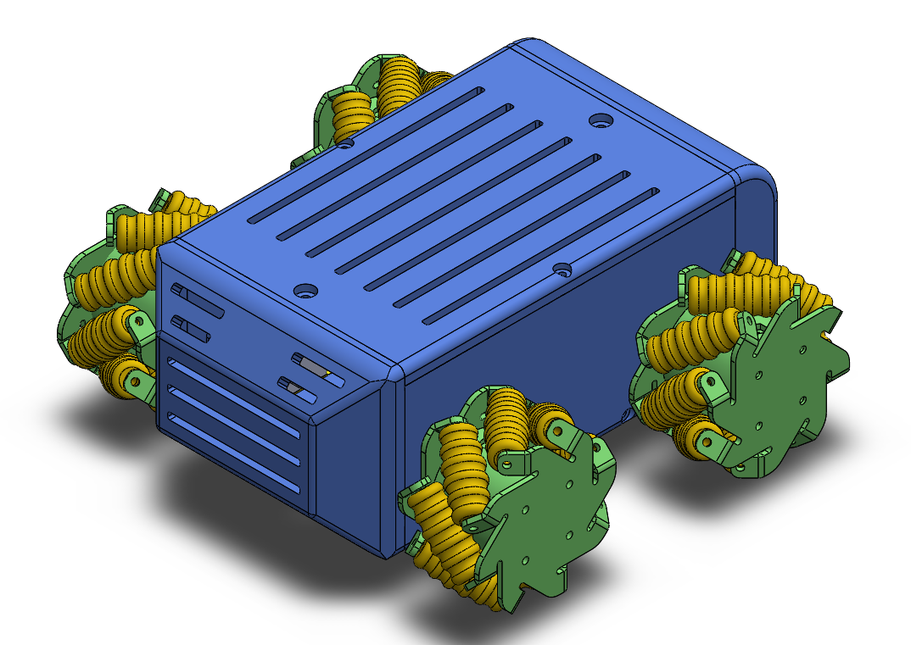
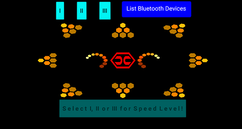
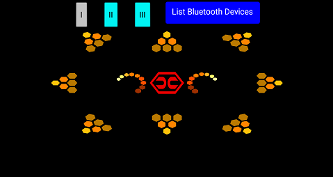
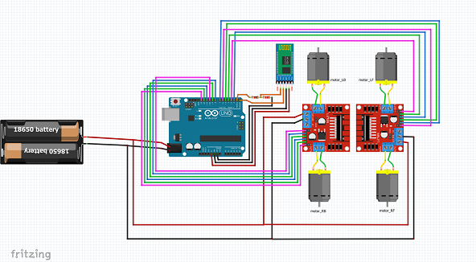

 

# Autotant
## Arduino Codes, Fritzing Files (for connecting hardware) and Android Apk (for bluetooth control) for cars with mecanum wheels

Being inspired by “Automation”, “Assistant” and “Mutant”, this product was named “Autotant”. “Autotant” is a multifunctional car platform. The gaps on the body allow the installation of different sensors, so it can be used as a robot that can perform different tasks depending on the equipment used. Line following cars can be made with line tracking sensors; obstacle avoiding cars can be made with ultrasonic or optical distance sensors. It can also be used as a remote control car with bluetooth or wireless transceiver. It is a prototype designed for indoor transportation. 

### How Autotant moves:

It was designed as a four-wheel-drive (4-WD) car platform that has mecanum wheel technology.
-	It can move forwards-backwards and right-left linearly.
-	It can move in diagonal directions linearly (forward-left, forward-right, backward-left, backward-right).
-	It can rotate around its own axis while it holds its position.

Cars with mecanum wheels can be controlled at different speed levels. 
### Requirements:
-	Arduino Uno
-	HC-05 Bluetooth Module
-	Dc Motor (250 rpm) x 4 pieces
-	L298N Dc Motor Driver x 2 pieces
-	Battery Holder (18650) x 1 piece
-	Battery (3.7V - high ampere value) x 3 pieces
-	Resistance (1k ohm) x 1 piece
-	Resistance (2.2k ohm) x 1 piece
-	Arduino IDE
-	Fritzing
-	A Smartphone (Android)

##### Mecanum_Car_Controller.apk :

##### Connecting Hardware :

### To get started, more details are at:
-	[grabcad.com/library/autotant-1](https://grabcad.com/library/autotant-1)
### Some other projects of mine:
-	[thingiverse.com/harun_c/designs](https://www.thingiverse.com/harun_c/designs)
